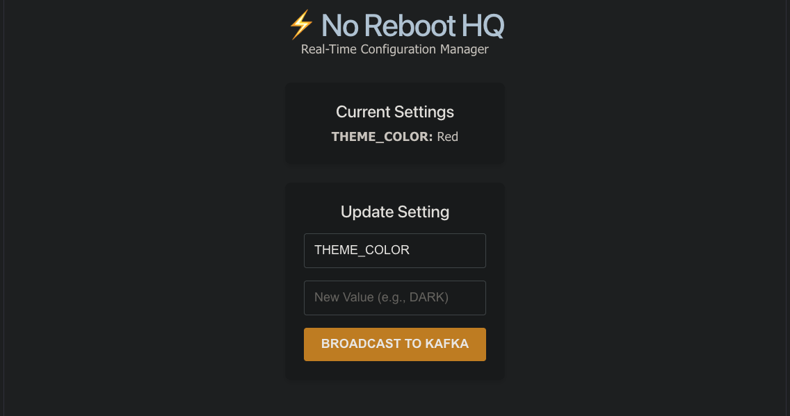

Perfect! Your folder structure is exactly where it needs to be. I see the **`README.md`** and **`screenshot.png`** sitting right at the top of the **`PROJECTS_JAVA`** folder.

However, looking at your editor on the right, you’ve accidentally pasted my conversation text (like "I see the confusion...") into the actual file! We want your GitHub page to look clean and professional, so let's fix that.

### Step 1: Clean Up the File

In your VS Code window (the one in the screenshot), **delete everything** currently in `README.md` and replace it with **only** the code block below:

```markdown
# ⚡ No Reboot HQ: Event-Driven Configuration Manager



## 📖 Overview
In modern enterprise microservices, restarting a server just to update a configuration variable (like a feature toggle, theme color, or maintenance mode) causes unacceptable downtime. **No Reboot HQ** solves this by utilizing an event-driven architecture to broadcast configuration changes in real-time across a distributed system. 

When an admin updates a setting via the React UI, the Spring Boot application updates the PostgreSQL database, refreshes the high-speed Redis cache, and publishes a message to an Apache Kafka topic. Any subscribed microservice can listen to this topic and instantly update its internal state—**zero downtime, zero reboots.**

## 🏗️ Tech Stack
* **Frontend:** React (Vite), HTML5, CSS3, JavaScript (ES6+)
* **Backend:** Java 17, Spring Boot 3, Spring Data JPA, Spring Kafka, Spring Data Redis
* **Messaging:** Apache Kafka (Message Broker)
* **Database & Cache:** PostgreSQL, Redis
* **Infrastructure:** Docker, Docker Compose

## 🔄 The Data Flow
1.  **UI Trigger:** User updates a configuration (e.g., `THEME_COLOR`) via the React Dashboard.
2.  **API Processing:** Spring Boot receives the request, persists it to **PostgreSQL**, and evicts the **Redis** cache.
3.  **Event Broadcast:** The application acts as a **Kafka Producer**, sending a JSON update message to the `config-updates` topic.
4.  **Real-Time Reaction:** A **Kafka Listener** (Consumer) intercepts the message instantly, allowing the system to update without a restart.

---

## 🚀 How to Run Locally

### 1. Prerequisites
* Docker Desktop installed and running
* Java 17 (JDK)
* Node.js (v18+)

### 2. Start the Infrastructure (Docker)
From the `config-manager` directory, run:
```bash
docker-compose up -d

```

### 3. Launch the Backend (Spring Boot)

Inside the `config-manager` directory, run:

```bash
./mvnw clean spring-boot:run

```

### 4. Launch the Frontend (React)

Open a **new terminal window**, navigate to the `noreboot-ui` directory, and run:

```bash
npm install
npm run dev

```

---

## 👨‍💻 Key Accomplishments

* **Full-Stack Integration:** Configured CORS to allow secure communication between React and Spring Boot.
* **Real-Time Messaging:** Implemented a Pub/Sub model using Kafka to eliminate system downtime for config changes.
* **Performance Optimization:** Utilized Redis as a Cache-Aside layer to reduce PostgreSQL read latency.

---

**Author:** Pratyush Singh